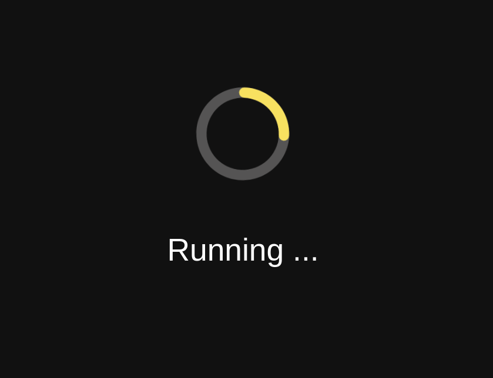

# voila-material

[](https://mybinder.org/v2/gh/voila-dashboards/voila-material/stable?urlpath=voila)

Material design template for voila

## Installation

You can install it using pip:

```
pip install voila-material
```

Or using conda:

```
conda install -c conda-forge voila-material
```

## Usage

```
voila my_notebook.ipynb --template=material
```

Or for the dark theme:

```
voila my_notebook.ipynb --template=material --theme=dark
```

### Light theme


### Dark theme



