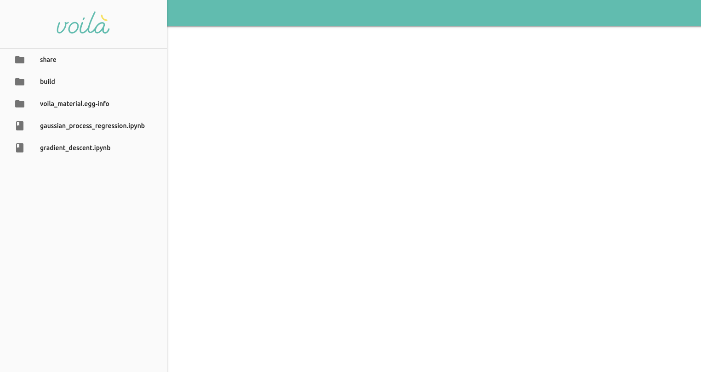
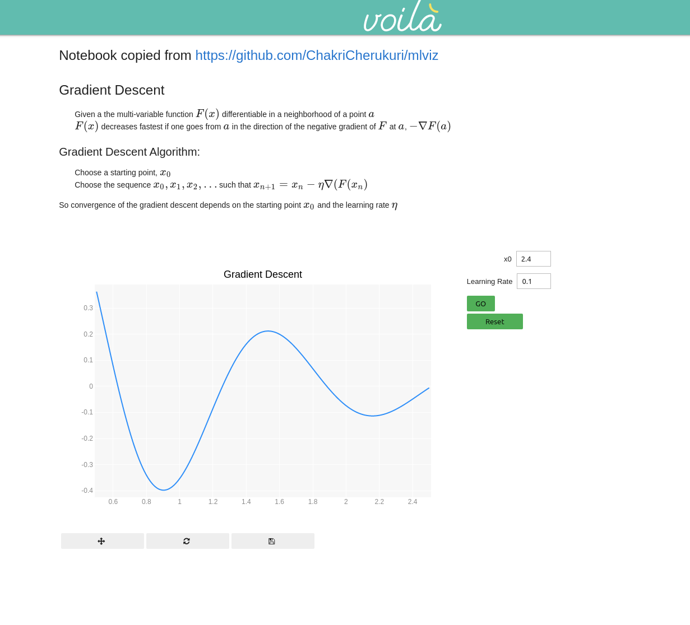
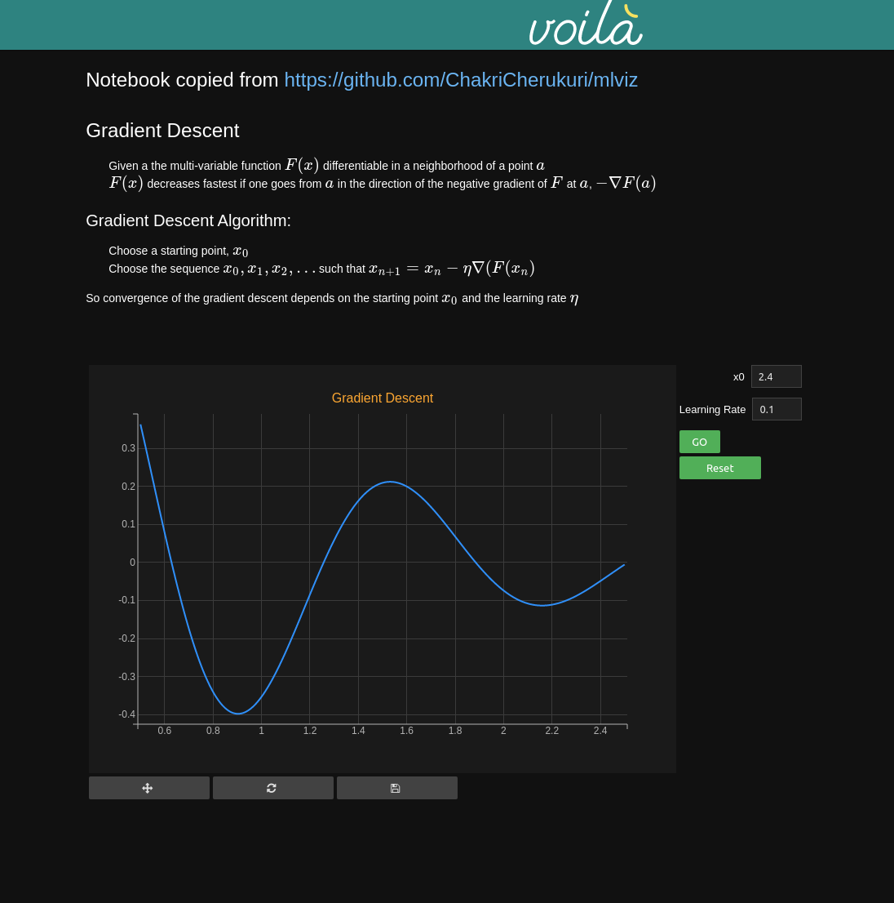

# voila-material

[](https://mybinder.org/v2/gh/martinRenou/voila-material/master?urlpath=voila)

Material design template for voila

## Installation

```
pip install voila-material
```

## Usage

```
voila my_notebook.ipynb --template=material
```

Or for the dark theme:

```
voila my_notebook.ipynb --template=material --theme=dark
```

## Example





Dark support


